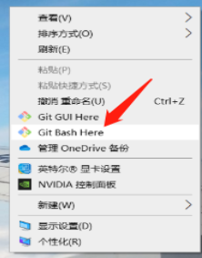
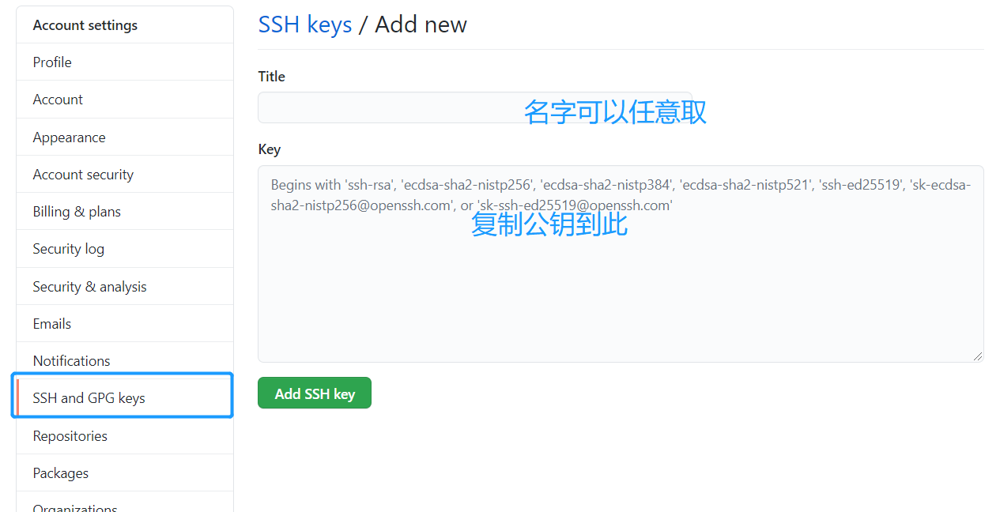

### 前言

Git仓库是对项目管理的核心工具。现在线上的github、码云、coding等，线下的gitlab、SCM Manager 等都是需要此工具操作。因此，掌握Git的相关知识还是比较重要的哦，本章讲的是Git的安装及基本使用。要使用Git，必须得先下载Git，美丽的故事就从下载这儿开始了。

### 1.Git的安装与配置

#### 1.1 安装

安装非常简单，其实就是一些傻瓜式的操作，直接就在他的官网上下载吧，我就不说话了，下载完后鼠标右键就会多出一个命令行工具，如图所示，未来window上的伙伴们就可以在命令行里操作了。至于mac的，听说按完后就自带的命令行工具就可以使用！



#### 1.2 配置

1.打开命令行终端输入 `ssh-keygen -t rsa -C "your_email@example.com"`( 你的邮箱)，连续点击 Enter 键即可。

```bash
$ ssh-keygen -t rsa -C "hansen@qq.com"     
```

2.添加公钥

①.在终端输入 `start ~/.ssh`，用文本编辑器打开『id_rsa.pub』文件，复制全部内容(linux 使用`open ~/.ssh`)

②.登录 github，点击右上方的头像，选择settings ，点击Add SSH key，把id_rsa.pub的内容复制到里面即可



 

用ssh -T git@github.com 去判断有没有成功，如下图所示就代表成功了，每种配置的方法大同小异


#### 1.3 一台机器控制多个仓库

有时候，你的项目存在不同的仓库下；那么，你就要配置不同的仓库了，说来也简单，看步骤。比如，这边我拿github和码云来举例吧。

先进入 cd /c/Users/HS/.ssh 目录创建(每个人的目录不尽相同)，未来也好管理。

1.创建2个证书

```java
1、根据每个repo用到的email生成ssh证书 ,填入自己在代码仓库中的邮箱帐号
 ssh-keygen -t rsa -C  "【你的邮箱】"
2、根据不同的git仓库进行命名，后面需要给每个仓库配置证书，这里我命名为id_rsa_github
Enter file in which to save the key (/c/Users/HS/.ssh/id_rsa): id_rsa_github
3、输入密码，一般都是直接回车，每次都是免密 
Enter passphrase (empty for no passphrase):
Enter same passphrase again: 
4、这样就在/c/Users/HS/.ssh/id_rsa)目录下生产了两个文件id_rsa_github和id_rsa_github.pub
5、执行上面同样的语句，再次生成一个证书 id_rsa_gitee
```

如图所示


2.在 .ssh 目录下新建config文件 编辑如下内容

```
#github(user 对应你的github用户名)
       Host github.com    
       HostName github.com
       IdentityFile ~/.ssh/id_rsa_github
       User Hansen1994

#gitee(user 对应你gitee用户名)
       Host gitee.com
       HostName gitee.com
       IdentityFile ~/.ssh/id_rsa_gitee
       User dream1994
```

然后可以使用了


### 2.工作流(与经理的对话)


---------------------------------第一天-----------------------------

`git init` 初始化仓库

`git add xxx.txt` / `git add . `添加文件/添加全部文件(将工作区的文件提交到暂存区)

`git commit -m "sss"`  提交本地仓库前取名 -m是我要加一个备注,sss是备注的内容

-----------------------第一天下班前(产品经理加了需求)----------------------------

me: 加班开始干活吧,balabala,敲敲敲···,然后提交到暂存区，不要提交到本地仓库

`git add xxx.txt` 把文件提交到暂存区

-----------------------到了第二天(产品经理说昨天下班前的需求不要了，客户又提了新的需求了)---------

me: 哎，开始删吧

`git reset HEAD` 把昨天提交到暂存区的东西返回到工作区（可以指定文件`git reset HEAD filepathname`）

`git checkout xxx.txt` 删除昨晚下班后的需求(他是删除工作区刚写完代码还没有提交到暂存区的代码，如果删除全部用 `git checkout .`谨慎使用)

me:继续开始产品经理今天的需求吧(和第一天的操作差不多最后进入本地仓库)下班

---------------------到了第三天(产品经理说第二天的东西都不要了，需求不要了)--------------------

me：我真是太不幸了~~

`git log`  查看每次更新的日志，找到最初第一天的内容编号

`git reset --hard 【版本号】 ，版本号可以通过git log去查看

------------------到了第四天(产品经理说本地文件也不要了)--------------

me: 好吧~我真是太可怜了~~

`git rm xxx.txt `将本地文件清

`git commit -m "delete xxx"` 清空本地仓库的文件


### 3. 还未建立远程仓库推送代码

me: 一切从0开始

```javascript
git init              初始化仓库

git README.md         添加文档

git commit -m "xxx"    -m为修改名称(任取)

git remote add origin git@e.github.net:han1994/dasadasa.git   将本地与远程的关联起来

git push -u origin master   往线上推送上去

git pull origin master 下载远程仓库的文件
```

### 4. 本地已有代码，这时想创建远程仓库做关联

这个时候，你本地已经写好代码了，想和远程的仓库做下关联

```javascript
git remote -v  查看关联信息

git remote add origin git@e.github.net:han1994/dasadasa.git  关联

git push origin master 推送
```

### 5. 打包管理

如果你已经写好了一个版本的代码，那么就可以进行打包，并标注标签

```
如果未来想要回滚，我们就可以使用标签进行回滚，而需要通过分支了！

git tag                                      查看所有标签

git tag name                             创建标签

git tag -a name -m "comment"   指定提交信息

git tag -d name                         删除标签

git push origin name                  标签发布
```

### 6.分支管理（多人协作）


多人开发其实就是编写属于自己的功能，可以创建自己分支，而不要在主分支上改动，最后进行合并即可！

#### 6.1多人开发的步骤

1.`git checkout -b 【xxx】 / git checkout 【xxx】` 新建一个分支/切换到另一个分支（git branch//查看分支和当前在哪条分支上）

2.然后用命令`vi a.js`去修改内容(vi属于linux内容，完成退出后可用命令`git status`去查看是否被修改或使用`git diff`去查看修改的内容)

3.`git add . `  //增加当前修改的所有代码

4.`git commit -m "update part2"`  //-m为修改名称(任取)

5.`git push origin 【xxx】` //往线上增加分支

--------半个月后功能完成（代码合并到主要分支master--------）

6.`git checkout master` //返回到master分支上

7.`git merge 【xxx】` //把之前改的xxx分支内容拷贝到master分支上来

8.`git push origin master` //完成后推送到线上去

#### 6.2 解决2人同时更改同一个分支导致代码推不上去的问题

假设本地的开发时候当你在编码时候，原本应该在分支上做改动而不小心在dev上做了改动

1. 我们可以先用`git stash`，将自己新的代码先推容缓存
2. 通过 `git pull origin dev`, 将代码拉下来
3. 执行`git stash pop`将暂存的东西释放出来返还到此分支上

这里切记: 你<font color=#fc5531>不要用 git checkout . </font>因为这会让你今天的工作都白费了。

#### 6.3 解决代码冲突问题

如果你代码拉下后，两个人的代码有冲突，先大家在一起讨论，看下谁改的合理，一般像vscode此类工具他会自动分析出，哪里代码有冲突。

### 7.git reset和git revert的比较

他们都是将代码复原的意思

#### git reset方法:

它可以回退远程上commit的的提交

步骤：

`git reset --hard HEAD~1` // 回退一个版本 后面的数字代表回滚的个数，2代表回退2个

`git reset --hard 【版本号】`// 作用与上条一样，版本号可以用git log查看或者去站点查看

`git push origin HEAD --force `// 远程提交回退

如图:


#### git revert

git revert是用于“反做”某一个版本，以达到撤销该版本的修改的目的。比如，我们commit了三个版本（版本一、版本二、 版本三），突然发现版本二不行（如：有bug），想要撤销版本二，但又不想影响撤销版本三的提交，就可以用 git revert 命令来反做版本二，生成新的版本四，这个版本四里会保留版本三的东西，但撤销了版本二的东西。

步骤:

①. `git revert -n` 【版本号】 我们可以先跳到此版本号，然后对bug进行修改

②. `git commit -m` 版本名 // 提交到新版本，如上面的版本四

③. `git push` // 最后推送到远程分支

如图:


### 8.git命令大全表

#### 8.1 git命令大全表


#### 8.2实用的linux命令

1. `cat` 文件名 //查看文件内容
2. `touch + 文件名` // 创建新文件
3.  `cp 【路径一】 【路径二】` // 将文件从路径一移动到路径二
4. `vi 文件` //新建文件并打开文件
5. `i` 插入文字 
6. `esc + :wq`//退出并保存文件内容